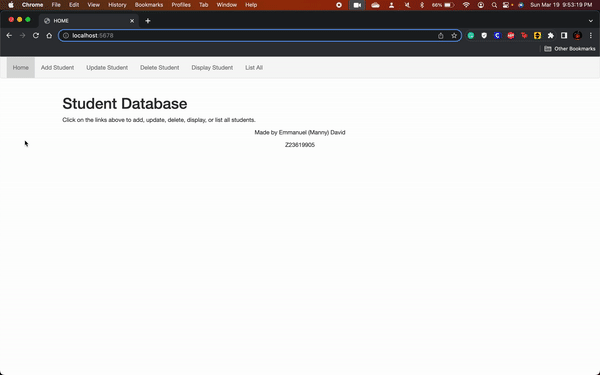

# MongoDB and EJS Implementation for Studentserver.js

## Emmanuel David / Z23619905

In this assignment on the front end, I was able to use EJS to include the Nav bar to each of the pages. On the back end, I was able to render each of the ejs pages, redo the studentserver using MongoDB in order to store and read the student information rather than using JSON files, and made it possible to search for any student using query parameters.
